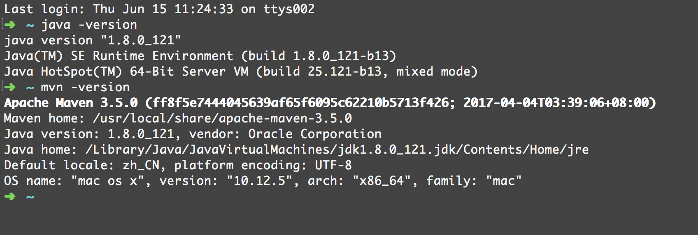
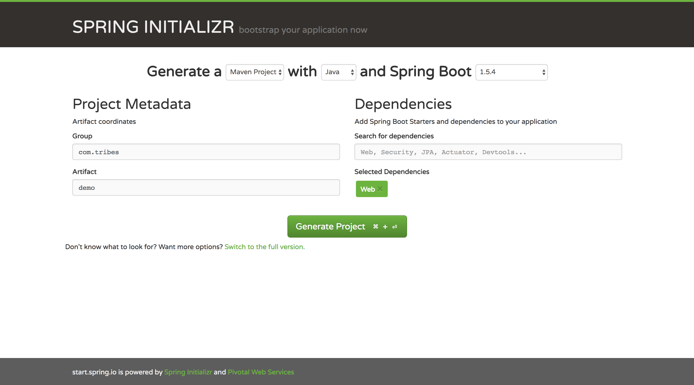
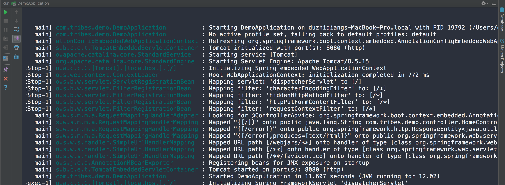

## Spring Boot 简介

Spring Boot简化了基于Spring的应用开发，你只需要`run`就能创建一个独立的，产品级别的Spring应用。我们为Spring平台及第三方库提供开箱即用的设置，多数Spring Boot应用只需要很少的配置。

你可以使用Spring Boot创建Java应用，并使用`java -jar`启动或采用传统的`war`部署方式。我们也提供一个运行Spring脚本的命令行工具。

Spring Boot的主要目标是：

* 为所有Spring开发提供一个从根本上更快，且随处可见的入门体验。
* 开箱即用，意思为很少的配置。
* 提供一系列大型项目常用的非功能性特征，比如：内嵌的服务器，安全，指标，健康检测，外部化配置。
* 没有代码生成，也没有XML配置。

## 系统要求

默认情况下，Spring Boot 1.5.4 RELEASE需要Java 7+，Spring Framework 4.3.9 RELEASE。如果使用Java 6的话需要一些额外的配置。Maven 3.2和Gradle 2.9以上已经明确提供了构建的支持。

虽然你可以在Java6或Java7环境下使用Spring Boot，通常建议尽可能使用Java8。

### 内置Servlet容器

[Servlet介绍](Servlet介绍)

|名称|Servlet版本|Java版本|
|--|----------|------|
|Tomcat 8|3.1|Java 7+|
|Tomcat 8|3.0|Java 6+|
|Jetty 9.3|3.1|Java 8+|
|Jetty 9.2|3.1|Java 7+|
|Jetty 9.1|3.0|Java 6+|
|Undertow 1.3|3.1|Java 7+|

## 安装Spring Boot

### 适用于开发者的安装说明

### Maven安装

[Maven官方网站](maven.apache.org)

**Mac OS**

`brew install maven`

**ubuntu**

`sudo apt-get install maven`

#### 一个最简单的`pom.xml`文件

```xml
<?xml version="1.0" encoding="UTF-8"?>
<project xmlns="http://maven.apache.org/POM/4.0.0" xmlns:xsi="http://www.w3.org/2001/XMLSchema-instance"
    xsi:schemaLocation="http://maven.apache.org/POM/4.0.0 http://maven.apache.org/xsd/maven-4.0.0.xsd">
    <modelVersion>4.0.0</modelVersion>

    <groupId>com.tribes</groupId>
    <artifactId>spring-example</artifactId>
    <version>0.0.1-SNAPSHOT</version>

    <!-- Inherit defaults from Spring Boot -->
    <parent>
        <groupId>org.springframework.boot</groupId>
        <artifactId>spring-boot-starter-parent</artifactId>
        <version>1.4.0.RELEASE</version>
    </parent>

    <!-- Add typical dependencies for a web application -->
    <dependencies>
        <dependency>
            <groupId>org.springframework.boot</groupId>
            <artifactId>spring-boot-starter-web</artifactId>
        </dependency>
    </dependencies>

    <!-- Package as an executable jar -->
    <build>
        <plugins>
            <plugin>
                <groupId>org.springframework.boot</groupId>
                <artifactId>spring-boot-maven-plugin</artifactId>
            </plugin>
        </plugins>
    </build>
</project>
```

**`spring-boot-starter-parent`**

* springboot官方推荐我们使用spring-boot-starter-parent，spring-boot-starter-parent包含了以下信息：

* 1、使用java6编译级别

* 2、使用utf-8编码

* 3、实现了通用的测试框架 (JUnit, Hamcrest, Mockito).

* 4、智能资源过滤

* 5、智能的插件配置(exec plugin, surefire, Git commit ID, shade).

### 其它方式安装Spring Boot

* Gradle安装
* Spring Boot CLI安装

## 第一个Spring Boot应用

### 在开始前，需要检查Maven和Java的版本是否可用


### 项目结构

```
|--- {project-name}
|   |--- src
|       |--- main
|           |--- java
|               |--- {com.example.demo}
|                   |--- controller
|                       |--- HomeController.java
|                   |--- Application.java
|           |--- resources
|       |--- test
|           |--- java
|               |--- {com.example.demo}
|                   |--- ApplicationTests.java
|--- .gitignore
|--- README
|--- pom.xml
```

**快速搭建项目结构**

[https://start.spring.io/](https://start.spring.io/)



### 添加代码

#### 应用程序主入口

```java
package com.example.demo;

import org.springframework.boot.SpringApplication;
import org.springframework.boot.autoconfigure.EnableAutoConfiguration;
import org.springframework.boot.autoconfigure.SpringBootApplication;

@SpringBootApplication
@EnableAutoConfiguration
public class DemoApplication {

    public static void main(String[] args) throws Exception {
        SpringApplication.run(DemoApplication.class, args);
    }
}
```

#### 第一个接口

在`controller`包下新建一个文件`HomeController.java`：

```java
// HomeController.java
package com.example.demo.controller;

import org.springframework.web.bind.annotation.RequestMapping;
import org.springframework.web.bind.annotation.RestController;

/**
 * Created by v-zhidu on 2017/6/15.
 */

@RestController
public class HomeController {

    @RequestMapping("/")
    public String home(){
        return "Hello World !";
    }
}
```

启动应用，打开浏览器，访问`http://localhost:8080`

> 可以通过添加`spring-boot-maven-plugin`依赖，通过`mvn package`命令打包应用，并以`java -jar demo-0.0.1-SNAPSHOT.jar`的方式启动应用。

---

## main方法

查看Spring Boot应用程序启动的日志，分析启动时都做了哪些基本的工作



* Spring Boot入口`main`方法遵循Java对于一个应用程序入口点的规定。main方法通过调用`run`，将业务委托给Spring Boot的`SpringApplication`类。
* `SpringApplication`将引导我们的应用，启动Spring。需要将`DemoApplication.class`作为组件传给`run`，以此告诉`SpringApplication`谁是主要的组件，并传递应用启动的所有命令行参数。
* 尝试加载`profile`文件以及各种配置。
* 相应的启动内嵌的Tomcat Web服务器，默认监听8080端口，加载`Servlet`类和相应的筛选器。
* 扫描`Controller`并注册路由。
* 监听端口的Http请求。

## 关于一些注解的解释

### @RestController 和 @RequestMapping

**@RestController** - 被称为构造型（stereotype）注解，它为阅读的人提供暗示（这是一个支持REST的控制器），当Web请求进来时，Spring会考虑是否用它处理。

**@RequestMapping** - 该注解提供路由信息。

这两个注解是Spring MVC中的注解，不是Spring Boot的特定部分。

### @EnableAutoConfiguration

这个注解告诉Spring Boot根据添加的jar依赖猜测你想如何配置Spring。由于`spring-boot-starter-web`添加了`Tomcat`和`Spring MVC`，所以`auto-configuration`将假定你正在开发一个web应用，并对Spring进行相应的设置。


